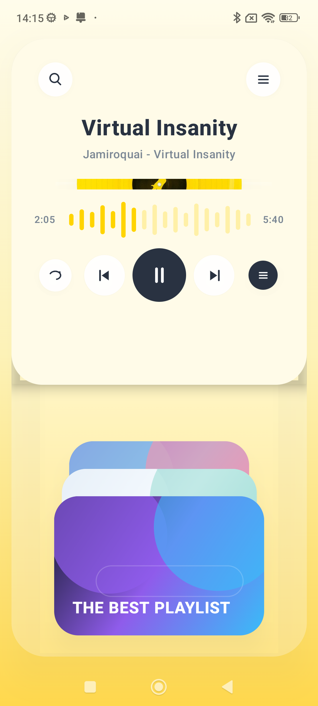

# Music Play

Experimento de Motion Design em Jetpack Compose focado em um player musical premium com superfícies neumórficas.

A experiência simula um player tátil com vinil animado, troca de faixas, folha de músicas, seleção de playlists, confirmação visual e uma timeline automática para apresentar o fluxo completo.

## Demonstração



## Destaques

- Interface neumórfica com painéis suaves, camadas translúcidas e contraste dinâmico por álbum.
- Vinil, waveform, linhas orgânicas de brilho e capas abstratas desenhadas com Compose e Canvas.
- Troca de faixa com sheet animada, atualização de capa, texto, progresso e botões contextuais.
- Seleção de playlists em stack com profundidade, escala, rotação e confirmação de escolha.
- Fluxo de apresentação automático baseado em uma state machine de composição única.
- Movimento baseado em `Animatable`, `updateTransition`, `AnimatedContent`, `AnimatedVisibility`, `spring`, `tween` e `graphicsLayer`.

## Interações

- Toque na lista de faixas para abrir e selecionar uma música.
- Use os controles do player para avançar, voltar, tocar ou pausar.
- Arraste horizontalmente a área de playlists para alternar entre álbuns.
- Toque em uma playlist para aplicar a seleção e disparar a confirmação.
- Acompanhe a timeline automática para ver o fluxo completo sem interação manual.

## Executar

```bash
./gradlew :app:assembleDebug
```

Instale em um dispositivo conectado:

```bash
adb install -r app/build/outputs/apk/debug/app-debug.apk
```

## Stack

- Kotlin
- Jetpack Compose
- Material 3
- Compose Animation
- Canvas
